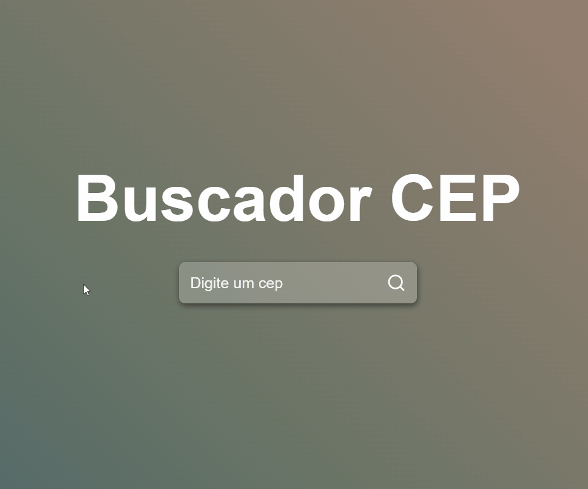

# Welcome to Buscador de CEP

This project was created with <a href="https://github.com/facebook/create-react-app">React</a>

 

## 📘 `About`

Find address information through Brazilian zip code query.

#### `DATA`
In these programs you will find the following information:
- address
- public place
- district
- state

 

 ## 🔨 `Tools`
 - [HTML](https://developer.mozilla.org/pt-BR/docs/Web/HTML)
 - [CSS](https://developer.mozilla.org/pt-BR/docs/Web/CSS)
 - [Javascript](https://developer.mozilla.org/pt-BR/docs/Web/JavaScript)
 - [React](https://reactjs.org/docs/getting-started.html)

 

 ## 📮 `Axios Request`
 data collection by [viacep](https://viacep.com.br/) where they are requested via json.  
Using the useState libraries from react and axios from axios

 

## 🙋🏾 ``Thanks for the support ``
For more information contact wesleywilsonbr@gmail.com

